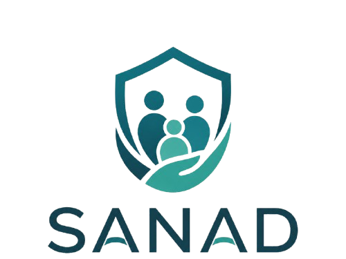
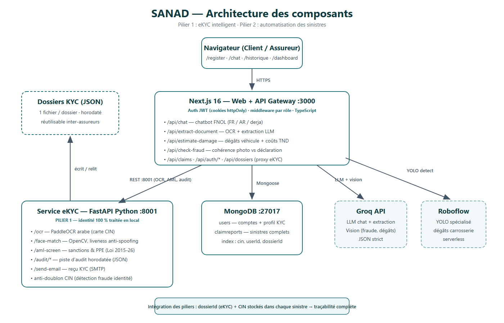

<div align="center">



# SANAD

### L'assurance tunisienne, réinventée par l'IA

**Vérifiez votre identité en 5 minutes. Déclarez un sinistre en 3 minutes. En français, en arabe ou en derja — 24h/24.**


[🚀 Installation](#-installation) · [🎬 Parcours de démo](#%EF%B8%8F-lancement--parcours-de-démonstration) · [🔑 Comptes de test](#-comptes-de-test) · [📚 Data room](#-data-room-technique)

</div>

---

## 💡 Le problème

En Tunisie, ouvrir un contrat d'assurance exige des déplacements en agence et des jours de paperasse. Déclarer un sinistre prend **des semaines**, uniquement aux heures ouvrables, avec des formulaires inaccessibles à une partie des assurés — et des décisions que personne n'explique.

## ✨ La solution

Une plateforme unique, **deux piliers**, zéro paperasse :

<table>
<tr>
<td width="50%" valign="top">

### 🪪 Pilier 1 — eKYC intelligent

- 📸 **Scan de la CIN** : lecture automatique de la carte d'identité (arabe + latin)
- 🤳 **Selfie vérifié** : correspondance faciale avec anti-usurpation
- 🛡️ **Conformité AML/CFT** : filtrage sanctions & PPE selon la **Loi 2015-26**
- 🚫 **Anti-fraude** : une CIN déjà enregistrée est bloquée instantanément
- 📋 **Piste d'audit complète** : chaque vérification horodatée, réutilisable par tout assureur

</td>
<td width="50%" valign="top">

### 🚗 Pilier 2 — Sinistres automatisés

- 💬 **Assistant 24/7** qui comprend le **français, l'arabe et la derja**
- 📷 **Photo → estimation** : l'IA évalue les dégâts et chiffre en TND
- 🧾 **Documents lus automatiquement** : factures, rapports de police, certificats
- 🕵️ **Détection de fraude** : la photo est confrontée à la déclaration
- ⚡ **Décision rapide et expliquée** : auto-approbation < 500 TND, sinon expert — chaque décision justifiée

</td>
</tr>
</table>

> 🔗 **Les deux piliers sont intégrés** : chaque sinistre est relié au dossier d'identité vérifié de son déclarant (`dossierId` + CIN) — traçabilité de bout en bout.

---

## 🏗️ Architecture

<div align="center">

</div>

| Composant | Technologie | Port |
|---|---|---|
| Web + API | Next.js 16 · React 19 · TypeScript | `3000` |
| Service eKYC | Python FastAPI · PaddleOCR (arabe) · OpenCV | `8001` |
| Base de données | MongoDB · Mongoose | `27017` |
| IA cloud | Groq (LLM + vision) · Roboflow (YOLO dégâts) | — |

Détails complets : [docs/ARCHITECTURE.md](docs/ARCHITECTURE.md) · [docs/TECH.md](docs/TECH.md)

---

## 🚀 Installation

### Option A — Script automatisé (Windows)

```powershell
.\scripts\setup.ps1        # npm + venv Python + dépendances + .env
.\scripts\start-all.ps1    # OCR :8001 + Next.js :3000
```

### Option B — Docker (tout-en-un)

```bash
cp .env.example .env       # renseignez vos clés
docker compose up --build  # web :3000 · ocr :8001 · mongo :27017
```

### Option C — Manuel

<details>
<summary>Dérouler les étapes</summary>

**1. Configuration**
```bash
cp .env.example .env   # éditez GROQ_API_KEY, ROBOFLOW_API_KEY, JWT_SECRET, SMTP_*
```

**2. Service eKYC (port 8001)**
```bash
cd ai-services/ocr-service
python -m venv venv
.\venv\Scripts\Activate.ps1        # Windows  |  source venv/bin/activate (macOS/Linux)
pip install -r requirements.txt
uvicorn main:app --reload --port 8001
```
> ⚠️ Lancement via `uvicorn main:app` (pas `python main.py`). Au premier démarrage, PaddleOCR télécharge ses modèles arabes.

**3. Frontend (port 3000)**
```bash
npm install
npm run dev            # → http://localhost:3000
```

**4. Comptes (une seule fois, dev server démarré)**
```bash
npm run seed:insurer   # compte assureur
npm run seed:demo      # client de démo + sinistre synthétique
```
</details>

---

## 🔑 Comptes de test

| Rôle | Email | Mot de passe | Accès |
|---|---|---|---|
| 🏢 Assureur | `insurer@sanad.tn` | `SanadInsurer2026!` | Tableau de bord, dossiers KYC, sinistres |
| 👤 Client | `demo.client@sanad.tn` | `DemoClient2026!` | Chat sinistre, historique |

*(créés par `npm run seed:insurer` et `npm run seed:demo` — modifiables via `.env`)*

---

## ▶️ Lancement & parcours de démonstration

1. **eKYC** — `http://localhost:3000/register` : CIN recto/verso → extraction automatique → screening AML → selfie → compte créé + email de confirmation. Retentez avec la même CIN : **« Fraude détectée »**.
2. **Sinistre** — connectez-vous en client → `/chat` : décrivez l'accident (essayez en derja : *« sadamt fi 9alb el mdina »*) → photos des dégâts → estimation en TND → constat signé → rapport complet avec score de fraude et explications.
3. **Historique** — `/historique` : le client retrouve tous ses sinistres et leurs estimations.
4. **Côté assureur** — `insurer@sanad.tn` → `/dashboard` : dossiers KYC en temps réel avec chaque étape de vérification horodatée.

---

## 🔧 Variables d'environnement

Copiez [.env.example](.env.example) vers `.env` :

| Variable | Requis | Rôle |
|---|:---:|---|
| `GROQ_API_KEY` | ✅ | Assistant FNOL, extraction documents, vision ([clé gratuite](https://console.groq.com/keys)) |
| `MONGODB_URI` | ✅ | Ex. `mongodb://127.0.0.1:27017/sanad` |
| `JWT_SECRET` / `SETUP_SECRET` | ✅ | Sessions + bootstrap assureur |
| `INSURER_EMAIL` / `INSURER_PASSWORD` | ✅ | Compte assureur |
| `ROBOFLOW_API_KEY` / `ROBOFLOW_MODEL` | ⭕ | Détection dégâts YOLO (fallback vision sinon) |
| `SMTP_SERVER` / `SMTP_USERNAME` / `SMTP_PASSWORD` / `SMTP_SENDER` | ⭕ | Email de reçu KYC |
| `NEXT_PUBLIC_OCR_API_URL` / `OCR_SERVICE_URL` | ⭕ | URL du service eKYC (défaut `http://localhost:8001`) |

> 🔒 `.env` est ignoré par git — ne commitez jamais de clés réelles.

---

## 🧪 Tests

```bash
npm test                                        # 17 tests TypeScript (Vitest)
cd ai-services/ocr-service
venv\Scripts\python.exe -m unittest discover tests -v   # 25 tests Python
```

**42 tests, 100 % verts** — grille de coûts, règles de routage, scoring AML, piste d'audit, anti-fraude CIN, parsing. Plan complet : [docs/TEST_PLAN.md](docs/TEST_PLAN.md)

---

## 📚 Data room technique

```
data-room/
├── README.md                        ← ce guide
├── 01_Architecture.pdf              ← composants, flux, intégration des piliers
├── 02_Data_Description.pdf          ← sources, formats, volumes, prétraitement
├── 03_Technical_Documentation.pdf   ← choix technos, versions, dépendances
├── 04_Test_Plan.pdf                 ← validation composant par composant
└── diagrams/
    ├── architecture.png             ← schéma des composants
    ├── flow.png                     ← flux de données (eKYC + sinistre)
    └── ERD.png                      ← modèle de données
```

Sources éditables : [docs/](docs/) · Slides : [presentation-sanad.txt](presentation-sanad.txt)

---

## 🛡️ Sécurité & conformité

- 🔐 Sessions **JWT** signées (cookie httpOnly) · mots de passe **bcrypt** · middleware par rôle
- ⚖️ Filtrage AML/CFT conforme **Loi n° 2015-26 du 7 août 2015** — base légale tracée dans chaque résultat
- 🪪 Données biométriques (CIN, selfie) traitées **100 % en local** — jamais envoyées au cloud
- 📜 Piste d'audit horodatée de chaque vérification d'identité
- 🚫 Détection automatique des identités dupliquées (double contrôle MongoDB + audit)

<div align="center">

---

**SANAD** — *votre allié assurance, en toute confiance* 🤝

</div>
