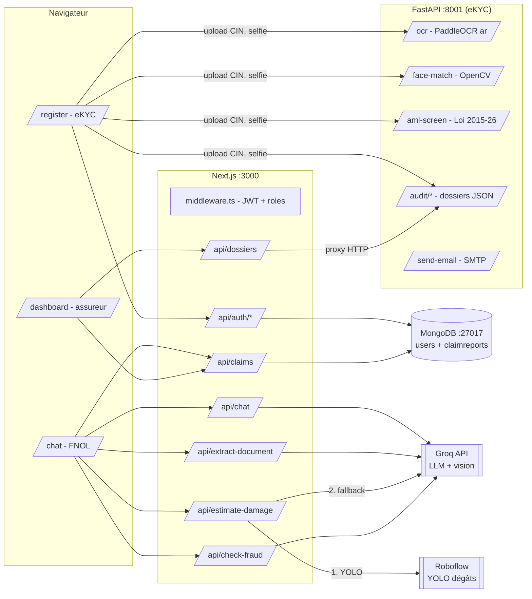

# SANAD — Schéma d'architecture détaillé

## 1. Vue d'ensemble

SANAD est composé de **deux services applicatifs** et **une base de données**, plus deux APIs cloud d'IA :

| Composant | Techno | Port | Rôle |
|---|---|---|---|
| **Web / API Gateway** | Next.js 16 (App Router, React 19, TypeScript) | 3000 | UI client & assureur, routes API serveur, auth JWT, orchestration IA |
| **Service eKYC** | Python 3.10+ / FastAPI + Uvicorn | 8001 | OCR CIN (PaddleOCR arabe), face-match/liveness (OpenCV), AML/PEP, audit trail, email |
| **Base de données** | MongoDB ≥ 6 (Mongoose) | 27017 | Comptes utilisateurs (KYC) + rapports de sinistres |
| **LLM Cloud** | Groq API | — | Chat FNOL, extraction de documents, vision (fallback dégâts, anti-fraude) |
| **Vision spécialisée** | Roboflow (YOLO `car-detection-damage/3`) | — | Détection des dégâts véhicule |

## 2. Pilier 1 — Flux eKYC (inscription `/register`)

1. `POST /audit/create` → création du **dossier KYC** (`KYC-AAAA-MM-JJ-xxxxxxxx`).
2. Upload recto/verso CIN → `POST /ocr` (prétraitement OpenCV → PaddleOCR arabe → classification → parsing champs CIN) → étape `OCR_SCAN` horodatée.
3. **Anti-fraude doublon** : vérification du CIN dans MongoDB (`/api/auth/check-cin`) *et* dans l'audit Python (`/check-cin`) ; un CIN déjà approuvé bloque l'inscription (« Fraude détectée »).
4. `POST /aml-screen` → matching flou (SequenceMatcher) contre listes **sanctions** (seuil 0,78, poids ≤ 50) et **PPE** (seuil 0,80, poids ≤ 30) + facteurs âge/région → score 0-100 → niveau LOW/MEDIUM/HIGH/CRITICAL → étape `AML_SCREENING`.
5. Selfie → `POST /face-match` (détection Haar cascade + corrélation NCC/histogrammes + variance Laplacienne pour la liveness) → étapes `LIVENESS_CHECK` et `FACE_MATCH`.
6. Validation des informations (`INFO_VALIDATION`) → `POST /api/auth/register` (MongoDB : email, hash bcrypt, CIN, `dossierId`, profil) → étape `ACCOUNT_CREATED` qui passe le dossier à `APPROVED` → email de reçu KYC (SMTP).

**Piste d'audit unifiée** : chaque dossier JSON (`ai-services/ocr-service/data/audit/`) contient l'identité extraite, le résultat AML et chaque étape horodatée — réutilisable par tout assureur via `GET /audit/list` (exposé au dashboard par le proxy `/api/dossiers`).

## 3. Pilier 2 — Flux sinistre (`/chat`)

1. **FNOL conversationnel** : `POST /api/chat` → Groq en mode JSON strict ; le prompt système (`src/lib/ai/fnolPrompt.ts`) gère **français, arabe standard et derja tunisienne (script arabe + arabizi)** ; collecte incrémentale de `{description, dateTime, location, vehiclesInvolved, injuries…}` avec suivi des champs manquants.
2. **Extraction de documents** : `POST /api/extract-document` → Tesseract.js (`fra+ara+eng`) ou pdf-parse → LLM Groq qui classifie (police/médical/facture) et structure les champs.
3. **Évaluation des dégâts** : `POST /api/estimate-damage` → **Roboflow YOLO** (dédoublonnage IoU 0,45 → sévérité par confiance → **grille de coûts TND** par classe de dégât, multiplicateurs de gamme) → fallback **Groq vision** → fallback heuristique déclarative.
4. **Anti-fraude** : `POST /api/check-fraud` → Groq vision compare photo vs constat (point de choc, dégâts, marque) → incohérences signalées, exige un rapport de police.
5. **Rapport & explicabilité** : `buildClaimReport.ts` agrège fourchette d'indemnisation, score de fraude, niveau de risque, confiance IA et attributions type SHAP (`ExplainabilityPanel`).
6. **Routage** : `businessRule.ts` — montant < 500 TND → **auto-approbation**, sinon **revue manuelle** par un expert.
7. **Persistance** : `POST /api/claims` → MongoDB `ClaimReport { userId, cin, dossierId, report }`.

## 4. Intégration entre les deux piliers

- Le **`dossierId`** généré par l'eKYC (Pilier 1) est stocké dans le compte utilisateur MongoDB **et** recopié dans chaque sinistre (`ClaimReport.dossierId`) : chaque sinistre est traçable jusqu'au dossier de vérification d'identité.
- Le **CIN** vérifié par OCR sert de clé anti-doublon des deux côtés (MongoDB + audit Python) et est indexé dans les sinistres.
- La **session JWT** (cookie httpOnly signé `jose`, rôles `client`/`insurer`) issue de l'inscription eKYC protège toutes les routes du Pilier 2 (`middleware.ts`).
- Le **dashboard assureur** consomme les deux piliers : dossiers KYC en direct (proxy `/api/dossiers` → audit Python) et sinistres (`GET /api/claims`, réservé au rôle assureur).

## 5. Stockage des données

| Donnée | Store | Localisation |
|---|---|---|
| Comptes (email, hash bcrypt, CIN, profil KYC, rôle) | MongoDB `users` | `mongodb://…/sanad` |
| Sinistres (rapport complet, scores, explicabilité) | MongoDB `claimreports` | idem |
| Dossiers d'audit KYC (étapes horodatées, AML, identité) | Fichiers JSON | `ai-services/ocr-service/data/audit/` |
| Listes sanctions/PPE/régions à risque (démo) | Fichier JSON | `ai-services/ocr-service/data/sanctions_pep.json` |
| Uploads temporaires OCR | Système de fichiers | `ai-services/ocr-service/uploads/` |
